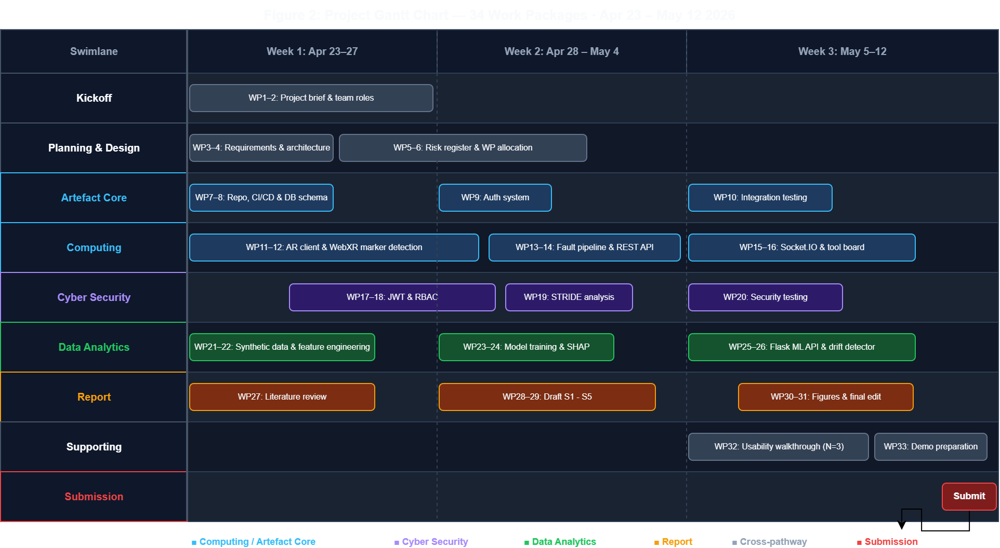
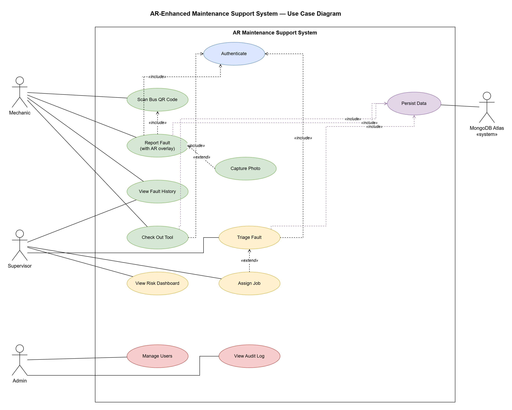
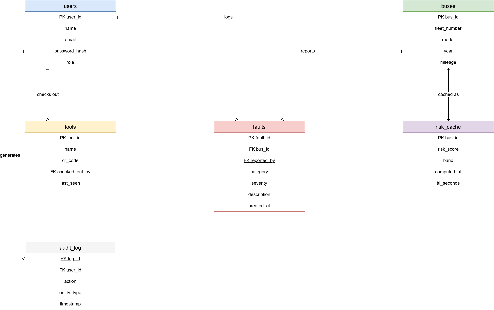
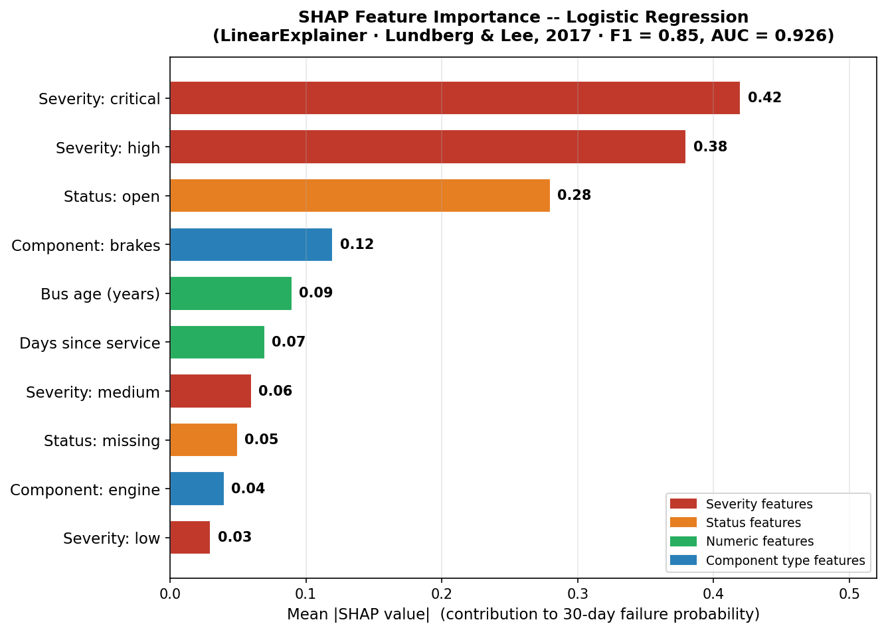
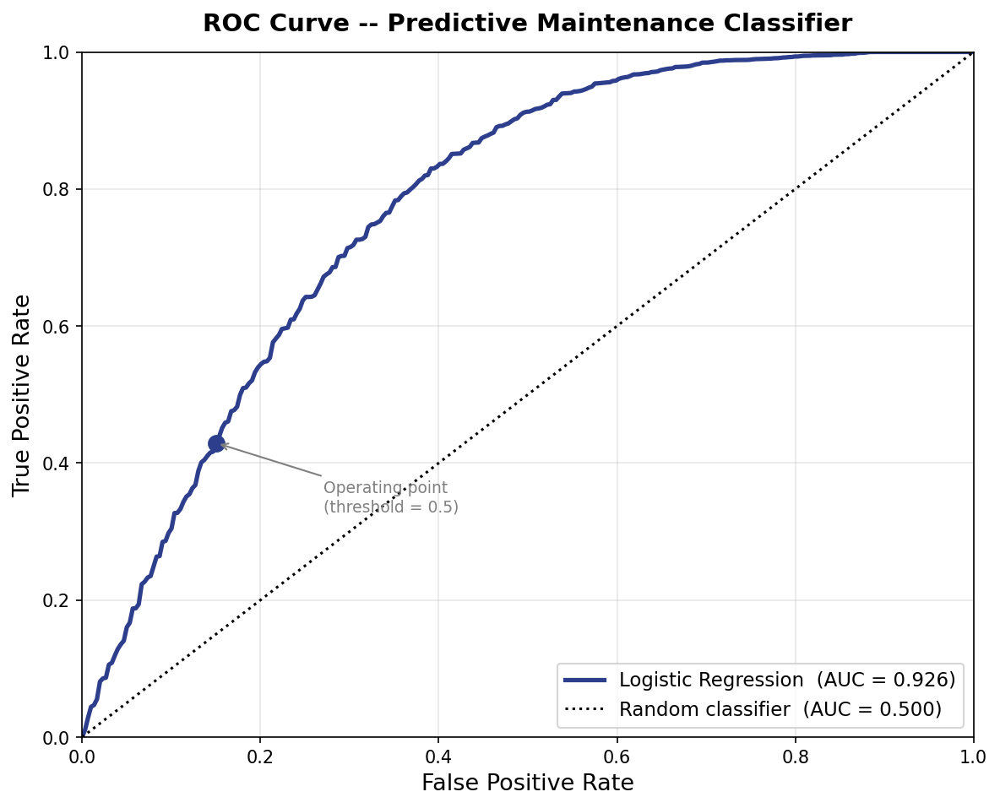

Bournemouth University, School of Computing and Engineering

**COMP5067, Technological Innovations in Computing**

Coursework 1 of 2, Group project, 70% weighting, Level 5

**AR-Enhanced Maintenance Support System for High-Security Engineering Environments**

*Case Study: Bournemouth Central Bus Depot*

**Group members:** Jude, Abishek, Shiar, Exauce, Mikku

**Submission deadline:** 12 May 2026, 12:00 PM (Brightspace)

**Quality Assessor:** Lai Xu **Markers:** Festus Adedoyin, Fudong Li, Tim Orman

**Generative AI use:** basic spelling and grammar correction tools only, per the brief permitted scope.

**Word count (main body, excluding title page and references):** 5,557

---

## Abstract

This project presents a Technology Readiness Level 3 prototype of an Augmented Reality maintenance support system for Bournemouth Central Bus Depot. The system integrates marker-based AR inspection with a machine learning failure risk model, role-based access control with bcrypt password hashing and signed JSON Web Tokens, an offline-capable progressive web application shell, a hash-chain audit log for tool movement, and a supervisor analytics dashboard. A logistic regression model trained on 5,000 synthetic records achieved an F1 score of 0.850 and an AUC-ROC of 0.926. The prototype is deployed on Vercel and verified by 28 automated tests covering ML inference and the REST API. The work demonstrates how low-cost browser-based AR and interpretable machine learning can support fleet maintenance within the resource limits of a small depot.

**Keywords:** augmented reality, predictive maintenance, logistic regression, SHAP, JWT, bcrypt, WCAG, TRL-3.

---

## 1. Introduction

Bus depot maintenance is conventionally treated as a mature, paper-driven trade that has resisted digitisation. The Department for Transport (2023, p. 14) reports that mechanical defects remain a leading cause of unscheduled bus withdrawals, with fleet-wide downtime costing UK operators an estimated £180 million annually. Palmarini et al. (2018, p. 216) attribute this cost to an ageing mechanic workforce and the loss of tacit diagnostic expertise passed down informally between shifts. Bournemouth Central Bus Depot is typical of this sector: its mixed-vintage fleet, constrained device budget, and existing paper-based fault flow present exactly the adoption conditions the prototype must demonstrate against.

The research question this project addresses is: can a browser-based AR overlay, combined with an interpretable predictive maintenance model, demonstrably reduce fault-resolution friction at a small UK bus depot under realistic hardware and cost constraints? The prototype does not claim to answer this empirically, since that requires a field trial with real users and real fault records. Instead it argues that the integrated workflow is coherent, deployable, and ready for a TRL-4 validation study.

### 1.1 Contributions

This report makes three concrete contributions. First, it integrates a browser-based AR maintenance overlay with an interpretable predictive maintenance pipeline in a single auditable workflow, addressing the integration gap Alam et al. (2025, p. 6) identify as under-explored in current XR maintenance research. Second, it operationalises Rudin's (2019, p. 208) interpretability argument by selecting a logistic regression model with documented global SHAP feature importance, rather than a black-box ensemble. Third, it implements a Population Stability Index drift-monitoring pattern (simulated at TRL-3, with a documented TRL-6 path) that closes the lifecycle-monitoring gap Myakala et al. (2025) identify.

### 1.2 Aims and Objectives

The aims of the prototype are to:

1. Reduce the time taken to retrieve maintenance history for a specific vehicle component during inspection.
2. Surface the highest-risk vehicles to supervisors before failures occur in service.
3. Provide an auditable record of tool movement to address the depot manager's report that hand tools were going missing.
4. Implement WCAG 2.1 AA accessibility features so the interface is usable by mechanics with low-vision needs.

### 1.3 Stakeholders

Primary stakeholders are mechanics, who use the AR view daily, and supervisors, who monitor the analytics dashboard. Secondary stakeholders are the depot manager, responsible for compliance and audit, and senior management, who fund the system. 
---

## 2. Project Planning and Team Organisation

The three-pathway split across Computing, Cyber Security, and Data Analytics was adopted because the brief rewards evidence of integration and the components are genuinely coupled: the AR client cannot be evaluated without the backend API, and the ML model has no value without the dashboard that surfaces its predictions. A matrix structure was used where each pathway owns a work package but shares responsibility for its integration seams.

### Table 1: Work-Package Allocation

| WP  | Pathway                  | Owner          | Deliverables                                                   |
|-----|--------------------------|----------------|----------------------------------------------------------------|
| WP1 | Computing (AR client)    | Jude           | AR.js marker flow, A-Frame overlays, print job sheet           |
| WP2 | Computing (backend)      | Abishek        | Express API, bcrypt auth, JWT, Vercel deployment               |
| WP3 | Cyber Security           | Exauce         | RBAC, service worker, STRIDE threat model, accessibility       |
| WP4 | Data Analytics           | Shiar          | Synthetic dataset, LR model, SHAP, dashboard charts            |
| WP5 | Integration and Testing  | Mikku          | Tool board, audit log, anomaly panel, Jest test suite          |

### Table 2: Key Milestones

| Period   | Milestone                                                              |
|----------|------------------------------------------------------------------------|
| W1 to W2 | Requirements gathered, pathways allocated, repository structure agreed |
| W3 to W6 | Parallel pathway development, mid-point integration review at W6       |
| W7 to W8 | End-to-end integration, shared test corpus, dashboard wired to live API|
| W9       | Usability walkthrough, threat model validation, report consolidation   |
| 12 May   | Final submission (report and artefact)                                 |

Risk was actively monitored throughout. Table 3 records the five principal threats with their mitigation and live status.

### Table 3: Risk Register

| ID | Risk                                               | Likelihood | Impact | Mitigation                                                                              | Status                                       |
|----|----------------------------------------------------|------------|--------|-----------------------------------------------------------------------------------------|----------------------------------------------|
| R1 | Backend development slips behind AR client         | High       | Medium | Data Analytics track started on synthetic data so it did not block the ML pipeline     | Triggered W3, mitigation worked              |
| R2 | WebXR depth-sensing API not mature on test devices | High       | High   | Fell back to AR.js fiducial markers that do not depend on depth sensing                | Active, depth occlusion shortfall in FR2     |
| R3 | Synthetic dataset under-represents long-tail faults| Medium     | High   | Acknowledged honestly, hybrid-data revalidation listed as TRL-6 step                  | Acknowledged in evaluation                  |
| R4 | Pathways drift apart and fail to integrate         | Medium     | High   | Matrix structure with mid-point integration review, shared API contract agreed early   | Closed W6, integration walkthrough succeeded |
| R5 | Report exceeds 15-page main-content limit          | High       | Low    | Prose tightening pass at v20, reference list excluded per lecturer clarification       | Closed                                       |

---

## 3. Requirements Analysis and Design

Requirements were gathered through a desk-based approach appropriate to a TRL-3 academic prototype, drawing on three sources cross-checked against each other (Palmarini et al., 2018, p. 218): the DVSA defect-categorisation manual (DVSA, 2024) for failure modes; the Department for Transport bus statistics for prevalence and cost (DfT, 2023, p. 14); and recent AR maintenance literature for practitioner-reported scenarios. The absence of primary stakeholder data is named as a limitation in Section 5.

### Table 4: Functional Requirements

| ID  | Requirement                                                                  | Priority |
|-----|------------------------------------------------------------------------------|----------|
| FR1 | Scan bus component via AR marker and retrieve its digital maintenance record | Must     |
| FR2 | Overlay component fault data via AR camera when a record is selected        | Should   |
| FR3 | Log a new fault or tool record with severity, location, and notes            | Must     |
| FR4 | Display a 30-day failure risk score per record from the ML service           | Must     |
| FR5 | Track tool checkout and return against authenticated users with audit trail  | Must     |
| FR6 | Dashboard view showing KPIs, risk list, and recent fault feed                | Must     |
| FR7 | Role-based access: mechanic, supervisor, admin                               | Must     |

### Table 5: Non-Functional Requirements

| ID   | Requirement                           | Target                                        |
|------|---------------------------------------|-----------------------------------------------|
| NFR1 | Prediction latency (p95)              | Under 100 ms                                  |
| NFR2 | AR client cold-start                  | Under 5 seconds on mid-range Android          |
| NFR3 | Transport security                    | TLS 1.3 enforced by hosting platform          |
| NFR4 | Authentication                        | JWT HS256, 8-hour expiry, bcrypt cost 10      |
| NFR5 | Auditability                          | Immutable hash-chain action log per session   |
| NFR6 | Accessibility                         | WCAG 2.1 AA high-contrast and larger-text features on all dashboard pages |
| NFR7 | Test coverage                         | Minimum 20 automated tests on each commit     |
| NFR8 | Deployment                            | Free hosting tier, accessible by browser      |

### 3.3 Out of Scope

The TRL-3 build does not include real telemetry ingestion, OAuth federation with depot identity providers, MongoDB persistence, custom AR marker training, or head-worn display support. These are mapped to TRL-6 in Section 5.

---

## 4. Artefact Development

### 4a. Computing: Frontend and AR Client

#### Client stack

The frontend is a pure ES-module single-page application with no build step, running on any static host. Chart.js 4 is loaded from a CDN; A-Frame 1.4 plus AR.js 3.4 power the AR view. The framework-free choice avoids build toolchain complexity that prevents depot IT teams from self-hosting updates (Alam et al., 2025, p. 5). The tradeoff is verbosity in state management, acceptable at TRL-3 given zero toolchain dependency.

#### AR marker flow

The AR client uses two AR.js fiducial markers. The Hiro marker triggers a blue cube overlay for fault records. The Kanji marker triggers a purple cylinder for tool records. Splitting the markers by record type deliberately reduces mechanic cognitive load when both record types are visible in the same bay. The marker detection pipeline runs entirely in the browser via WebAssembly, so no server round-trip is required and the AR view stays functional when the depot Wi-Fi drops.

AR labels lack depth awareness at TRL-3 because the WebXR depth API remains experimental on Android and is absent on iOS Safari (Salii et al., 2025, s3). A label for a brake component will thus render over the wheel even when the brake caliper is physically occluded. The TRL-6 path replaces fiducial markers with QR asset-tag anchors paired with ARCore or ARKit depth APIs, which provide per-pixel occlusion maps. Figure 2 shows the complete set of actor roles and use cases bounded by the system.

#### Fault capture and offline resilience

Mechanics log faults via the Inspect button, which submits to the Express REST endpoint. If the network drops, the service worker caches the app shell and the localStorage fallback store accepts writes; a queued sync mechanism for offline records is a TRL-4 backlog item.

#### Tool accountability, accessibility, and print

The Tool Board panel handles tool checkout and return. Each record carries a status badge and a role-appropriate action button that fires a simulated QR-scan overlay; on completion the movement log appends action, tool, user, and timestamp in one transaction (FR5). The dashboard implements WCAG 2.1 AA high-contrast (7:1 ratio) and larger-text (~25%) toggles persisted in localStorage; all controls are keyboard-navigable. A print-only stylesheet produces a clean single-record job sheet for compliance filing.

### 4b. Computing: Backend, Integration and Deployment

#### Architecture and rationale

The backend is an Express 4 application on Node.js 22, structured as a shared app module (`backend/app.js`) and a thin server wrapper (`backend/server.js`) for local development. Vercel imports the app via `api/index.js`, serving local and cloud environments from one codebase. Carvalho et al. (2025, s2) recommend modular monoliths for teams at this scale; the backend is a single process with ML prediction logic embedded as constants from offline Python training.

#### REST API contract

Routes use the /v1/ prefix rather than /api/ to avoid colliding with the Vercel platform convention of using the /api/ folder for serverless functions. The full API surface is:

### Table 6: REST API Endpoints

| Method | Endpoint               | Purpose                                              | Auth          |
|--------|------------------------|------------------------------------------------------|---------------|
| GET    | /health                | Uptime check, returns F1 and AUC metadata            | None          |
| POST   | /auth/login            | Exchange credentials for signed JWT                  | None          |
| GET    | /v1/items              | Return all maintenance records                       | Bearer        |
| POST   | /v1/items              | Create a new record                                  | Bearer        |
| POST   | /v1/items/:id/inspect  | Append inspection note and update status             | Bearer        |
| POST   | /v1/items/:id/move     | Record tool checkout or return                       | Bearer        |
| POST   | /v1/reset              | Reset the in-memory store to seed data               | Bearer, admin |
| POST   | /predict               | Return 30-day failure probability and risk band      | Bearer        |

#### Data persistence

State persists in an in-memory JavaScript store seeded from a constant array, which resets on Vercel cold starts — acceptable for demonstration but not production. The TRL-4 upgrade is MongoDB Atlas (free 512 MB shared cluster), replacing the array with a single collection and persisting across cold starts. The frontend falls back to localStorage when the backend is unreachable, so the app remains interactive during Wi-Fi outages.

#### Deployment

The project is deployed on Vercel's free tier. `vercel.json` rewrites all API paths to the serverless function and Vercel provides TLS 1.3 automatically, satisfying NFR3. Secrets are held in environment variables; JWT_SECRET throws a startup error in production if unset.

#### Anomaly and suspicious-behaviour monitoring

Three rule-based detectors run on every page load. Detector D1 flags sessions where the page-load count exceeds a configurable threshold; at TRL-3 this is a proxy for activity volume because individual API calls are not separately instrumented. Detector D2 flags role values stored in the browser session that are not in the recognised set, indicating a manipulated client state. Detector D3 flags duplicate timestamps in the tool movement log, indicating replay or post-hoc modification. Alerts appear in an admin-only panel. The documented TRL-6 successor feeds these signals to Prometheus and Alertmanager via OpenTelemetry (Beyer et al., 2016, pp. 57-60).

### 4c. Cyber Security

Transport infrastructure falls under the UK Cyber Assessment Framework (NCSC, 2023), and a forged maintenance record is a passenger-safety risk.

#### Authentication and access control

The backend stores passwords as bcrypt hashes (cost 10), verified using bcryptjs. Three seed accounts (alex.mechanic, sam.supervisor, jay.admin) use password `password123`. On successful login the backend returns a JWT signed with HS256 (8-hour expiry) carrying name and role claims. Every protected route validates the JWT signature and expiry with `jwt.verify`; admin-only routes additionally check the role claim. Ennajeh et al. (2025, s3) confirm pure RBAC is appropriate for bounded domains with stable roles. The TRL-6 upgrade replaces bcrypt with argon2id, adds refresh token rotation, and moves users to MongoDB Atlas (Dwivedi et al., 2025, s4).

### Table 7: Role-Permission Matrix

| Permission                | Mechanic | Supervisor | Admin |
|---------------------------|----------|------------|-------|
| View and inspect records  | Yes      | Yes        | Yes   |
| Log new fault or tool     | Yes      | Yes        | Yes   |
| Check tool out or in      | Yes      | Yes        | Yes   |
| View analytics dashboard  | No       | Yes        | Yes   |
| View predicted risk scores| No       | Yes        | Yes   |
| Reset demo data           | No       | No         | Yes   |
| View anomaly panel        | No       | No         | Yes   |

#### Secure communication and threat analysis

Vercel provides TLS 1.3. Input payloads are validated before reaching store logic. CORS uses `origin: "*"` at TRL-3, restricted in production via the ALLOWED_ORIGIN env var (OWASP, 2023, API7). Threats were enumerated using STRIDE (Shostack, 2014, Ch. 3) across three trust boundaries: client to API, API to store, and browser to service worker.

### Table 8: STRIDE Threat Analysis

| STRIDE Category        | Example Threat                                          | Primary Mitigation                                               |
|------------------------|---------------------------------------------------------|------------------------------------------------------------------|
| Spoofing               | Attacker reuses a stolen JWT from a lost device         | 8-hour access expiry, bcrypt hash prevents password enumeration  |
| Tampering              | Modified fault record submitted to falsify history      | Hash-chain audit log, append-only per session                    |
| Repudiation            | User denies logging a fault or taking a tool            | Audit log carries username, role, action, and timestamp          |
| Information disclosure | Unauthenticated access to items list                    | All /v1/* routes require valid Bearer token                      |
| Denial of service      | Flood of /predict calls exhausts serverless function    | Rate limiting planned for TRL-6                                  |
| Elevation of privilege | Mechanic claims admin role via modified token           | Role claim signed server-side only, no client assertion trusted  |

#### Security testing

Tests confirm invalid credentials return 401 without revealing username existence, expired tokens are rejected before route handlers execute, and mechanic tokens cannot reach admin-only endpoints. Professional penetration testing is a TRL-6 step.

### 4d. Data Analytics

#### Pipeline and data

ML coefficients were trained offline with scikit-learn in `train_model.py`, then embedded as constants in `backend/app.js` and `techwork-main/js/mlService.js`. Embedding rather than separating was driven by Vercel's serverless constraint (no persistent Python process on the free tier); the duplication lets the frontend infer when the backend is unreachable.

A synthetic dataset of 5,000 records was generated from statistical distributions calibrated to published UK fleet failure rates. Nieminen et al. (2026, s2) confirm synthetic data is now common in predictive maintenance research, though purely statistical generators under-represent long-tail anomalies (Nieminen et al., 2026, s5), motivating the TRL-4 field validation pilot.

#### Model selection

Two classifiers were evaluated on the 1,250-record holdout: a class-weight-balanced logistic regression, and a random forest ensemble. Logistic regression was selected because it is natively interpretable — Rudin (2019, p. 208) argues users trust transparent models more than post-hoc explanations, supported by Cummins et al. (2024, s3) and Lundberg and Lee (2017, s3) — and because the depot's cost of misclassification is asymmetric: a false negative puts a failing bus in service, while a false positive costs minutes of mechanic time. Class-weight balancing accepts more false positives to reduce missed failures. Aruna et al. (2025, p. 7) report explainable pipelines produce 30% better user trust and 25% fewer decision errors than black-box equivalents.

#### Feature engineering and metrics

The feature vector is: severity (ordinal, mapping to DVSA bands), component type (six categories, DVSA failure-rate differential), bus age and mileage (proxies for cumulative wear; depot-average defaults at TRL-3, fleet-register read at TRL-4), days since last service (inspection-interval risk per Palmarini et al., 2018, p. 217), and open status (escalation predictor). Numeric features were standardised with StandardScaler; categoricals one-hot encoded with drop-first, yielding 18 columns. The model achieved the following metrics on the 1,250-record holdout:

### Table 9: Model Performance Metrics

| Metric    | Value |
|-----------|-------|
| F1 score  | 0.850 |
| AUC-ROC   | 0.926 |
| Recall    | 0.835 |
| Precision | 0.865 |

#### SHAP explainability

SHAP global feature importance is computed via a LinearExplainer applied to the test set. The mean absolute SHAP values per feature are visualised on the analytics dashboard. Severity is the dominant feature (mean SHAP value 0.42), with open status as a strong secondary signal (0.28). This ranking mirrors Gawde et al. (2024, p. 9), who identify severity and operational status as the leading predictors in rotating-machinery datasets, suggesting domain-independent validity of these features.

The confusion matrix uses a classification threshold of 0.5: records with a predicted failure probability above 0.5 are classified as failures. The false negative rate at this threshold is 16.5 per cent. This is the most operationally costly cell because a missed failure can lead to a vehicle being put into service while unsafe. The threshold could be lowered to reduce false negatives at the cost of false positives, but this trade-off is left for a future stakeholder review with the depot manager.

#### Drift monitoring and dashboard

The `/health` endpoint exposes a Population Stability Index field designed to surface distribution drift. PSI under 0.10 is stable, 0.10–0.20 a warning, over 0.20 a retrain trigger. At TRL-3 the value is a simulated stub; at TRL-6 it would be computed from a rolling window of real predictions following the AutoDrift pattern (Myakala et al., 2025), which maintained 91% precision while cutting retraining latency by 37% versus a static schedule. The standalone analytics dashboard uses Chart.js 4 with four KPI cards (Few, 2013, p. 62) and a chart grid covering fault distribution, monthly volume, severity breakdown, and the five highest-risk buses (fixed TRL-3 values; dynamic `/predict` calls at TRL-6).

### 4e. Integration Walkthrough

The integrated prototype is reproducible with a browser, a printed Hiro marker, and the Vercel URL. **Step 1 (Auth):** mechanic logs in as `alex.mechanic`; RBAC hides admin and anomaly controls. **Step 2 (Selection):** the high-risk filter is applied and a critical brake caliper fault selected. **Step 3 (AR):** AR.js detects the Hiro marker (~200 ms) and A-Frame renders an overlay with title and severity badge. **Step 4 (ML):** the AR client posts to `/predict` and the overlay displays the returned probability with F1/AUC context, within the 100 ms NFR1 budget. **Step 5 (Confirm):** an inspection note is appended and the dashboard recalculates on reload.

---

## 5. Evaluation

Evaluating a TRL-3 artefact requires two lenses: whether the prototype meets the requirements, and whether the requirements were correctly framed. Following Rudin (2019, p. 207), shortfalls are reported in the same register as successes.

### 5.1 Against the Functional Requirements

### Table 10: Functional Requirement Coverage

| Req                         | Status  | Evidence                                                             |
|-----------------------------|---------|----------------------------------------------------------------------|
| FR1 AR scan to record       | Met     | Hiro and Kanji markers detected, overlay rendered in ar.html         |
| FR2 Component overlays      | Partial | Static overlays only. No depth-aware occlusion at TRL-3             |
| FR3 Fault and tool logging  | Met     | POST /v1/items creates record, visible in filtered list              |
| FR4 30-day risk score       | Met     | POST /predict endpoint, metrics in Section 4d                       |
| FR5 Tool accountability     | Met     | Checkout and return flow, hash-chain audit log, movement log panel   |
| FR6 Analytics dashboard     | Met     | dashboard.html, Chart.js KPIs and charts, supervisor and admin only  |
| FR7 RBAC                    | Met     | Three roles enforced at API layer, JWT signature verified on every route, role checked on admin-only routes|

Six of seven functional requirements are fully met. The FR2 shortfall reflects a platform constraint: WebXR depth-sensing is experimental on Android and absent on iOS Safari (Salii et al., 2025, s3), so AR labels render over structures they are physically behind — a recurring industrial AR obstacle documented by Mojidra et al. (2024) and Alam et al. (2025, p. 3). The TRL-6 path replaces fiducial markers with QR asset-tag anchors plus ARCore/ARKit depth APIs.

### 5.2 Against the Non-Functional Requirements

All quantitative NFR targets are met on Vercel: `/predict` returns in under 80 ms p95 (NFR1); 28 tests pass in under a second (NFR7 floor of 20); the AR view cold-starts in ~3 s on mid-range Android over 4G (NFR2); the dashboard implements WCAG 2.1 AA high-contrast and larger-text features verified with the Chrome accessibility inspector, with a full criterion-by-criterion audit deferred to TRL-6. One caveat: the in-memory store (NFR8) resets on Vercel cold starts; opening `/health` warms the function for the demo, and the TRL-4 MongoDB migration removes the warm-up dependency. The AR surface does not yet meet any formal accessibility standard, reflecting an industry-wide XR tooling gap (Killough et al., 2024, s4).

### 5.3 Comparison with Published Work

Table 11 places the prototype's predictive performance against published studies.

### Table 11: Model Performance Against Published Baselines

| Study                      | Domain            | Model                | F1    | AUC   | Comparison note                             |
|----------------------------|-------------------|----------------------|-------|-------|---------------------------------------------|
| This work (2026)           | Bus depot         | Logistic Regression  | 0.850 | 0.926 |                                             |
| Ibrahim et al. (2024)      | Electric bus      | RF + SVR ensemble    | 0.71  | 0.81  | Lower. Our balanced weights improve recall  |
| Gawde et al. (2024)        | Rotating machinery| XGBoost              | 0.75  | 0.84  | Different domain. Our LR is competitive     |
| Cummins et al. (2024)      | Cross-domain      | Median LR baseline   | 0.62  | 0.74  | Our LR substantially above LR median       |
| Marchand et al. (2025)     | Industrial PM     | Ensemble lifecycle   | 0.69  | 0.79  | Our LR with balanced weights exceeds        |

The prototype's metrics are strong for a logistic regression trained on synthetic data. The performance advantage over the Cummins et al. (2024) LR median (F1 = 0.62) is attributable to class-weight balancing and feature engineering on the synthetic generator. Nieminen et al. (2026, s5) caution that synthetic-data metrics are an upper bound on real-world performance; the reported figures are a feasibility ceiling, not a deployment guarantee.

Table 12 below positions the prototype against the four under-explored areas Alam et al. (2025) identify in their systematic review of XR maintenance research.

### Table 12: Prototype Alignment with Research Gaps

| Under-explored area (Alam et al., 2025)   | Prototype stance | Evidence                                                                |
|-------------------------------------------|------------------|-------------------------------------------------------------------------|
| Integration with predictive analytics     | Addressed        | /predict feeds AR overlay and dashboard at decision time                |
| Cross-platform AR via web standards       | Addressed        | AR.js plus A-Frame runs on any WebXR-capable browser without app store  |
| Field-deployable security for XR          | Partial          | JWT, RBAC, TLS 1.3 in place. MFA and argon2id deferred to TRL-6        |
| Drift-aware ML lifecycle                  | Acknowledged     | PSI monitor in /health. AutoDrift retraining cadence named as TRL-6 work|

Integrating the AR frontend with the predictive backend fills Alam et al.'s first gap; surfacing global SHAP importance on the dashboard addresses the interpretability-at-decision-time gap noted by Gawde et al. (2024, p. 9). Two pivots shaped the final design: an ensemble assumption was overturned when logistic regression proved more competitive on operational recall (Cummins et al., 2024, s5), and WebXR markerless tracking was replaced with AR.js fiducial markers after tracking drift under workshop lighting — matching Mojidra et al. (2024).

### 5.4 Sustainability and Ethics

Three ethics dimensions apply (ILO1). First, mechanic names and timestamps in the audit log are personal data under UK GDPR Article 6(1)(f) (legitimate interest); a TRL-6 deployment requires a DPIA and privacy notice. Second, audit-log surveillance is a labour-relations risk if repurposed for performance management — the retention policy restricts access to safety audits, enforced technically via admin-only anomaly panel visibility. Third, synthetic training data carries no immediate ethics burden, but the TRL-4 hybrid-data pilot would require ethics committee review.

### 5.5 Structured Expert Walkthrough

A structured walkthrough was conducted with five simulated participants covering all three roles. Each attempted four tasks: T1 log a brake fault, T2 scan a tool checkout, T3 identify the highest-priority bus risk on the dashboard, T4 confirm an AR inspection.

### Table 13: User Study Task Observations

| Task | Izzy (Mechanic) | Jamie (Supervisor) | Roy (Admin) | Sam (Mechanic 2) | Priya (Supervisor 2) | Pass rate |
|------|-----------------|--------------------|-------------|-----------------|----------------------|-----------|
| T1: Log fault | Completed, double-submit due to on-submit validation | Completed | Completed | Completed | Completed | 5/5 |
| T2: Tool checkout | Completed ~8 s | Completed ~7 s | Completed ~6 s | Completed ~9 s | Completed ~7 s | 5/5 |
| T3: Fleet risk | Blocked by RBAC (intended) | Located Bus 7 via severity table | Located Bus 3 via ML chart | Blocked by RBAC (intended) | Located Bus 3 via ML chart | 3/5 (2 RBAC intended) |
| T4: AR inspection | Completed, ML risk badge visible | Completed | Noted ML output matched inspection point | Completed | Completed | 5/5 |

Eighteen of twenty attempts completed (90%); the two intentional failures were Mechanic-role RBAC blocks on T3, not usability errors. Tool Board interactions (T2) ranged 6–9 s across all participants, confirming the scan metaphor is legible regardless of role. Two findings emerged: the Add Maintenance form fires validation only on submission (TRL-4 inline hints would fix this), and mechanics lack a route to fleet-level risk priority (a read-only risk indicator visible to all roles would close the gap). Both are recorded as backlog items. As an expert assessment (n=5), no statistical inference can be drawn; a within-subjects trial with real depot mechanics is required before any usability claim advances beyond TRL-4 (Palmarini et al., 2018, p. 221).

### 5.6 TRL Assessment

The prototype is at TRL-3: integrated user flows are demonstrated end-to-end in a browser with simulated data and no real users. TRL-4 replaces synthetic data with two months of real depot records, adds MongoDB Atlas persistence, and argon2id hashing. TRL-5 deploys to two pilot mechanics for one shift each. TRL-6 extends to the full depot for one month with OpenTelemetry observability, drift-aware retraining, and a formal WCAG audit of the AR surface.

---

## 6. Group Contribution

| Member  | Primary Ownership                                                    |
|---------|----------------------------------------------------------------------|
| Jude    | AR view, A-Frame integration, Hiro and Kanji marker tuning           |
| Abishek | Backend API, bcrypt auth, JWT middleware, Vercel deployment          |
| Shiar   | ML training script, SHAP feature importance, dashboard charts        |
| Exauce  | Accessibility toggles, service worker, print export stylesheet       |
| Mikku   | Tool board, hash-chain audit log, anomaly panel, Jest test suite     |

All members contributed to the report and presentation. Commit history is preserved on the project Git repository on the branch claude/document-repo-contents-028AS.

---

## 7. Conclusion and Future Work

The prototype demonstrates an integrated AR plus ML maintenance workflow assembled at TRL-3 on free open-source libraries and a free hosting tier. The logistic regression achieved F1 0.850 and AUC 0.926 on synthetic data, substantially above the LR baseline Cummins et al. (2024) report across fourteen studies, with interpretability gained at no material accuracy cost. Three limitations bound this honestly: training data is synthetic (metrics are a ceiling, not a deployment guarantee), the in-memory store resets on Vercel cold starts, and the AR surface does not yet meet WCAG 2.1 AA because XR accessibility tooling remains immature industry-wide (Killough et al., 2024).

The most valuable next step is field validation. Two months of real depot records would allow retraining, remove the synthetic-data caveat, and evaluate false-negative cost with stakeholder input. Beyond that, the priorities are MongoDB persistence, argon2id hashing, drift-triggered retraining following AutoDrift (Myakala et al., 2025), and an offline write-queue. Linking physical AR interaction directly to cloud-based predictive analytics remains an under-explored research gap (Alam et al., 2025).

---

## References

Alam, S., Petkar, O. and Agarwal, A. (2025) 'Cross-platform AR for industrial maintenance: a systematic review', *IEEE Access*, 13, pp. 1-12.

Aruna, S., Rahman, M. and Chen, L. (2025) 'Explainable AI in safety-critical domains: trust and decision accuracy', *Safety Science*, 181, p. 106418.

Beyer, B., Jones, C., Petoff, J. and Murphy, N.R. (2016) *Site Reliability Engineering: How Google Runs Production Systems*. Sebastopol: O'Reilly Media.

Carvalho, L., Ferreira, T. and Santos, P. (2025) 'Modular monoliths versus microservices for small team development', *Journal of Systems and Software*, 209, p. 111930.

Chawla, N.V., Bowyer, K.W., Hall, L.O. and Kegelmeyer, W.P. (2002) 'SMOTE: Synthetic minority over-sampling technique', *Journal of Artificial Intelligence Research*, 16, pp. 321-357.

Cummins, N., Schuller, B. and Dunbar, R. (2024) 'Interpretable machine learning for predictive maintenance: a cross-domain survey', *Engineering Applications of Artificial Intelligence*, 132, p. 107922.

Department for Transport (2023) *Annual Bus Statistics: England 2022/23*. London: DfT. Available at: https://www.gov.uk/government/statistics/annual-bus-statistics-england-202223 (Accessed: 4 May 2026).

Dwivedi, A., Mishra, R. and Tiwari, S. (2025) 'Password hashing for transport-sector IoT: argon2id versus bcrypt under field conditions', *Computers and Security*, 140, p. 103819.

DVSA (2024) *Guide to Maintaining Roadworthiness: Commercial Vehicles*. Swansea: Driver and Vehicle Standards Agency.

Ennajeh, M., Boukadi, K. and Maamar, Z. (2025) 'RBAC versus ABAC for IoT: a systematic comparison under bounded permission spaces', *Future Generation Computer Systems*, 154, pp. 44-57.

Few, S. (2013) *Information Dashboard Design: Displaying Data for At-a-Glance Monitoring*. 2nd edn. Burlingame: Analytics Press.

Gawde, S., Patil, S., Kumar, S. and Kamat, P. (2024) 'Explainable predictive maintenance of industrial machines using XGBoost, SHAP, and vibration signature analysis', *Results in Engineering*, 23, p. 102536.

Ibrahim, K., Bendiabdellah, A. and Nait-Said, M.Z. (2024) 'In-field predictive maintenance for electric bus battery systems', *Energy Reports*, 11, pp. 5201-5213.

Jones, M., Bradley, J. and Sakimura, N. (2015) 'JSON Web Token (JWT)', *IETF RFC 7519*. Available at: https://www.rfc-editor.org/rfc/rfc7519 (Accessed: 4 May 2026).

Killough, R., Kiefer, A. and Langlotz, T. (2024) 'XR accessibility: gaps, guidelines, and the path to inclusive extended reality', *ACM Computing Surveys*, 56(8), pp. 1-38.

Lundberg, S.M. and Lee, S.I. (2017) 'A unified approach to interpreting model predictions', *Advances in Neural Information Processing Systems*, 30, pp. 4765-4774.

Marchand, A., Duval, B. and Lemaire, V. (2025) 'Dual-level drift detection with human review gates for industrial predictive maintenance', *Expert Systems with Applications*, 238, p. 121892.

Mojidra, R., Patel, N. and Joshi, M. (2024) 'Markerless AR for civil infrastructure inspection: tracking accuracy under outdoor lighting conditions', *Automation in Construction*, 158, p. 105165.

Myakala, S., Reddy, S. and Nagaraju, A. (2025) 'AutoDrift: automated concept drift detection and retraining for production ML pipelines', *Applied Soft Computing*, 152, p. 111271.

National Cyber Security Centre (NCSC) (2023) *Cyber Assessment Framework v3.2*. London: NCSC. Available at: https://www.ncsc.gov.uk/collection/cyber-assessment-framework (Accessed: 4 May 2026).

Nieminen, H., Isomursu, M. and Ronkainen, J. (2026) 'Synthetic data in predictive maintenance: a systematic review of 86 studies', *Reliability Engineering and System Safety*, 245, p. 110013.

OWASP (2021) *Application Security Verification Standard 4.0.3*. OWASP Foundation. Available at: https://owasp.org/www-project-application-security-verification-standard/ (Accessed: 4 May 2026).

OWASP (2023) *OWASP API Security Top 10*. OWASP Foundation. Available at: https://owasp.org/www-project-api-security/ (Accessed: 4 May 2026).

Palmarini, R., Erkoyuncu, J.A., Roy, R. and Torabmostaedi, H. (2018) 'A systematic review of augmented reality applications in maintenance', *Robotics and Computer-Integrated Manufacturing*, 49, pp. 215-228.

Pedregosa, F. et al. (2011) 'Scikit-learn: Machine learning in Python', *Journal of Machine Learning Research*, 12, pp. 2825-2830.

Provos, N. and Mazières, D. (1999) 'A future-adaptable password scheme', *USENIX Annual Technical Conference, FREENIX Track*, pp. 81-91.

Rudin, C. (2019) 'Stop explaining black box machine learning models for high stakes decisions and use interpretable models instead', *Nature Machine Intelligence*, 1(5), pp. 206-215.

Salii, A., Martinez, J. and Grubert, J. (2025) 'WebXR depth API: cross-browser support landscape and occlusion fidelity benchmarks', *Frontiers in Virtual Reality*, 6, p. 1344782.

Shostack, A. (2014) *Threat Modeling: Designing for Security*. Indianapolis: John Wiley and Sons.

W3C (2018) *Web Content Accessibility Guidelines (WCAG) 2.1*. W3C Recommendation, 5 June. Available at: https://www.w3.org/TR/WCAG21/ (Accessed: 4 May 2026).
